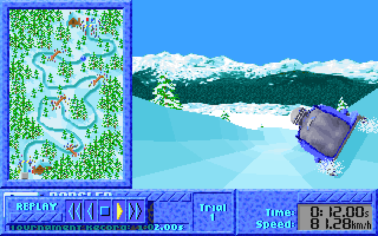

# The Games: Winter Challenge - GOG is selling a broken game

> This is a summary of what the game is and how it is broken. If you want all the gory technical details, you can find them in the [detailed write-up](writeup/writeup.md).
> If you just want to fix your copy of the game, you can use the [online patcher](patcher/index.html).

The Games: Winter Challenge is a winter olympics sports video game developed by MindSpan and published by Accolade in 1991 for DOS and Sega Genesis.

The DOS version uses a [code wheel](https://www.oldgames.sk/codewheel/games-winter-challenge) based copy protection scheme, which requires you to turn the wheel and enter the resulting code into the game.

However, this game is extra sneaky and does additional **hidden copy protection checks** not only checks for the code wheel answer when this screen appears, but also in various places throughout the game.
If it detects that you did not correctly answer the code wheel, e.g. by modifying the game to skip over it, it would alter the game in subtle ways to mess with your illegitimate play session in varying amusing and frustrating ways.

As it turns out, **all widely available versions of this game are improperly cracked this way and trigger these hidden copy protection checks, including the version you can [buy on GOG](https://www.gog.com/en/game/summer_winter_olympic_challenge), as well as all the various online playable or downloadable versions.**.
Worse still, the GOG version has the improper crack baked into the binary they distribute, so you don't even have the option to use an uncracked version and enter the code wheel answer yourself (as of March 2025).

## What do the hidden copy protection checks do?

The subtle (and sometimes not so subtle) gameplay differences can reliably be shown using the built-in replay feature of the game, where relpaying the same inputs on a broken version leads to different results.

### Ski Jump

One of the most obvious changes is in the Ski Jump event: When the copy protection check fails, any attempt land a ski jump beyond a certain distance fails.
More specifically, beyond a distance of 86.7m, the game won't recognize you pressing Enter to land your jump anymore:

 
(if the two animations are not in sync, try reloading this page in a new tab)

### Speed Skating

This is the second very obvious change: In the third lap in Speed Skating, the game won't allow you to turn forcing you to crash into the wall:

 
(if the two animations are not in sync, try reloading this page in a new tab)

### Biathlon

In Biathlon, the copy protection check happens during the shooting sections.
If the check fails, it will move your shot by a random amount to the top right, on the second and fourth target in each segment:

 
(if the two animations are not in sync, try reloading this page in a new tab)

### Downhill

The Downhill event also has a copy protection check.
It is activated partway into the run, and if it fails it changes the physics behavior to lower the gravity, making you fly off the track:

 
(if the two animations are not in sync, try reloading this page in a new tab)

### Bobsled

The alteration in the Bobsled event is probably the most subtle.
When the copy protection check fails, after the first couple of turns, the physics change to give you more drag, slowing you down more than usual:

 
(if the two animations are not in sync, try reloading this page in a new tab)

### Luge

The last of the copy protection checks is the most drastic.
During the Luge event, if you are close to the end of the track with a time of below 57.7s, the game just instantly forfeits your run, preventing you from finishing it:

 
(if the two animations are not in sync, try [building a bridge across the peaks of Mt. Kilimanjaro](https://www.youtube.com/watch?v=46btEgKmCTo))

## Help, I have a broken version of the game!

In case you have bought this game from GOG or have one of the many other broken versions out there, I have created a tool to fix the game for you.
You can go [here](patcher/index.html) and use the tool to patch your binary to remove the hidden copy protection checks (as well as the debugger and code wheel checks themselves in case they are not removed already), so you can enjoy this game without any limitations.

## What about the Summer Challenge game?

The game is sold on GOG together with its sequel "Summer Challenge", released a year later by the same developer.
That game re-uses a lot of the same code, including for the code wheel check and hidden copy protections.

**The GOG version of Summer Challenge is also broken**, which is somewhat more surprising because the widely available alternative cracks for this game actually do work properly.

The tool mentioned above is also able to fix this game as well.

If you are interested in what the gameplay alterations look like for that game, [go here](writeup/summer/summer_diffs.md).

