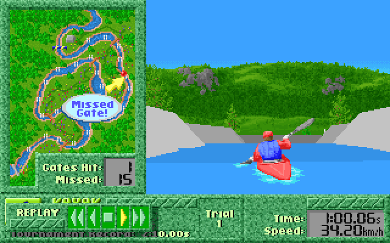
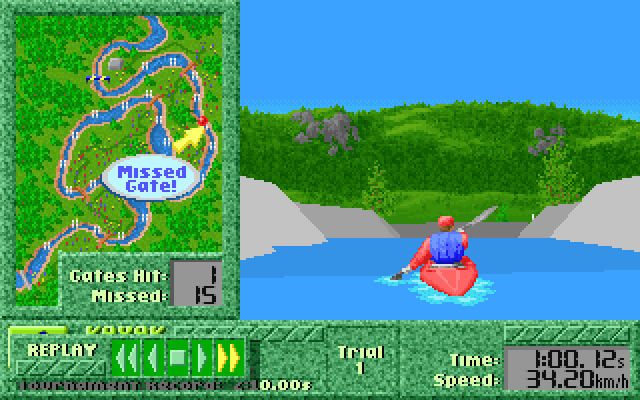
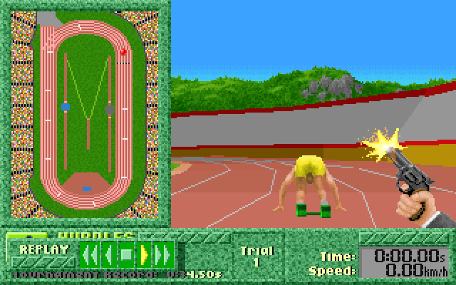
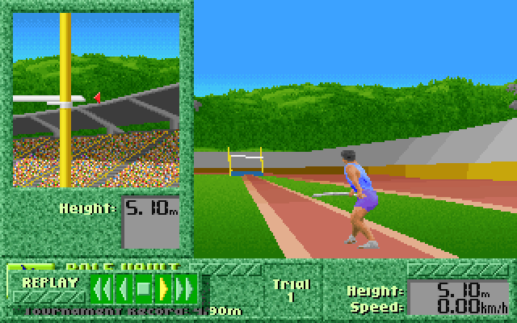
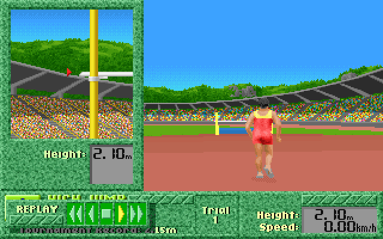
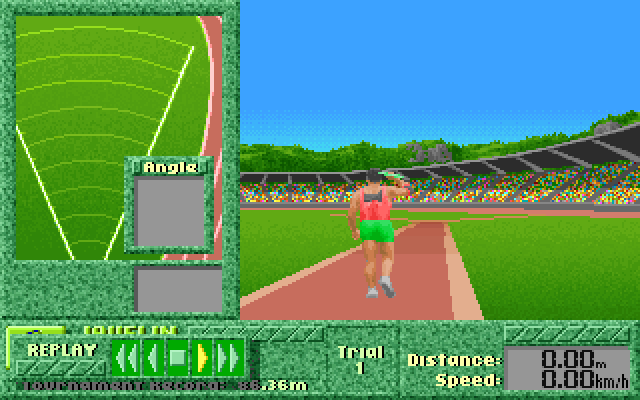
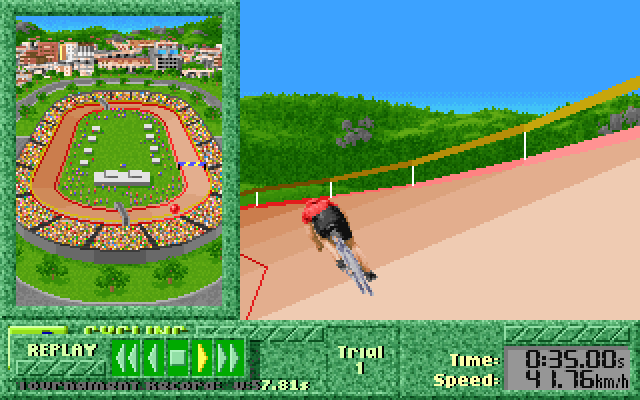

Similar to [its predecessor](../../index.md), Summer Challenge also uses hiddden copy protection checks throgout the game which trigger sublte gameplay alterations to mess with you if you didn't successfully pass the code wheel copy protection check.

If you just want to fix your copy of the game, you can use the [online patcher](patcher/index.html).

### Kayak

Shortly before the end, the kayak drifts towards the left, crashing into the shore.

 
(if the two animations are not in sync, try reloading this page in a new tab<a> or click here</a>)

### 400m Hurdles

When the copy protection check fails, the game makes you trip over hurdles when you otherwise would have cleared them, slowing you down.

 
(if the two animations are not in sync, try reloading this page in a new tab<a> or click here</a>)

### Pole Vault

When the copy protection check fails, the game makes you unable to release the pole at the height of your jump, so you inevitably hit the bar.

 
(if the two animations are not in sync, try reloading this page in a new tab<a> or click here</a>)

### High Jump

When the copy protection check fails, the game makes you unable to jump when running at high speeds.

 
(if the two animations are not in sync, try reloading this page in a new tab<a> or click here</a>)

### Javelin

When the copy protection check fails, the game makes you unable to control the angle of the javelin, significantly reducing the possible distance.

 
(if the two animations are not in sync, try reloading this page in a new tab<a> or click here</a>)

### Cycling

When the copy protection check fails, the game makes you drift towards the outer wall in the 3rd lap, and crash into it.

 
(if the two animations are not in sync, try reloading this page in a new tab<a> or click here</a>)

